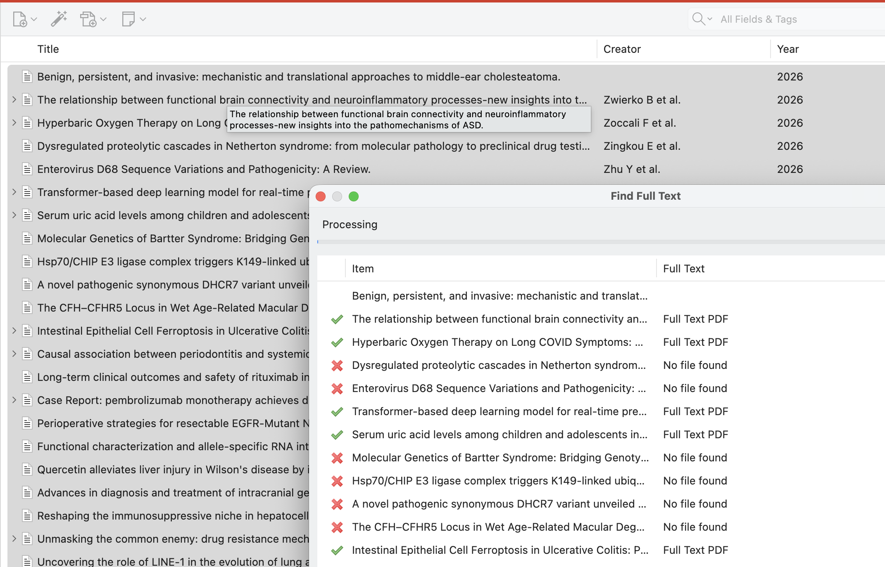

# Export a Reference Cache to Zotero

This workflow turns a checked-in public reference cache into a Zotero collection,
asks Zotero to find available PDFs, and then inventories the resulting attachments
without putting closed manuscripts into the project repository.

The three stores remain separate:

| Store | Purpose | Safe to commit? |
|---|---|---:|
| Project `references_cache` | Reproducible public validation evidence | Yes |
| Zotero library | User-managed references and PDF attachments | No |
| Private research cache | Extracted user-library text for agent context | No |

Normal validation reads only the first store.

## 1. Export metadata from the public cache

Run the exporter from the `linkml-reference-validator` checkout. For dismech:

```bash
uv run linkml-reference-validator cache export \
  --cache-dir /Users/cjm/repos/dismech/references_cache \
  --needs-full-text \
  --output /Users/cjm/Downloads/dismech-zotero.json
```

`--needs-full-text` is the default. It excludes cache entries that already have
full text, excludes non-publication identifiers, and deduplicates by normalized
DOI and then PMID. The CSL JSON output uses an explicit metadata allowlist:

- title and authors;
- journal and year;
- DOI; or
- PMID and its public PubMed URL.

It never contains cached article text, excerpts, provenance, PDFs, local paths,
or private-cache data. The command refuses to replace an existing output file;
use `--force` only after checking the destination. Use `--all` if you explicitly
want eligible references that already contain full text.

## 2. Import the file into Zotero

In Zotero:

1. Choose **File → Import**.
2. Choose **A file**.
3. Select `dismech-zotero.json`.
4. Keep the imported records in a project-specific collection such as
   **dismech**.

CSL JSON is a standard format supported by Zotero. Importing the file adds only
bibliographic records; it does not copy anything from the validator's caches.

## 3. Ask Zotero to find PDFs

Select one or more top-level journal articles in the center item list,
right-click the selection, and choose **Find Full Text**. It is a built-in Zotero
command, not a plugin.



The command appears for an eligible parent item that has a DOI and does not
already have a file attachment. It may also be unavailable in a group library
where files cannot be added. If it is absent, first test a single article in
your personal library and confirm that its DOI field is populated.

For a large import, start with a modest batch rather than all records at once.
Publishers can temporarily rate-limit repeated requests, and a later retry may
find additional files. Zotero reports **Full Text PDF** or **No file found** for
each attempted item.

## 4. Inventory the enriched Zotero library

Once Zotero finishes, scan the project cache again:

```bash
uv run linkml-reference-validator cache enrich \
  --provider zotero \
  --cache-dir /Users/cjm/repos/dismech/references_cache \
  --dry-run
```

This read-only scan matches exact DOI, PMID, or PMCID identifiers and reports
which cached references now have usable Zotero text or PDF attachments. It does
not invoke **Find Full Text** and does not modify Zotero.

After reviewing the matches, materialize them into the separate private research
cache:

```bash
uv run linkml-reference-validator cache enrich \
  --provider zotero \
  --cache-dir /Users/cjm/repos/dismech/references_cache \
  --apply
```

Apply mode leaves `references_cache` unchanged. Private content goes to
`~/.cache/linkml-reference-validator/private` by default with owner-only
permissions. Agents may inspect it for context, but validation cannot use it as
evidence.

## 5. Validate reproducibly

Run validation normally. Results remain reproducible because the validator
reads the public project cache and accepts only public full-text provider results.
Neither the contents of Zotero nor the machine-specific private cache affect
validation.

## See also

- [Fetching Full Text and PDFs](fetch-full-text-and-pdfs.md)
- [Zotero: importing standardized formats](https://www.zotero.org/support/kb/importing_standardized_formats)
- [Zotero: adding files to a library](https://www.zotero.org/support/attaching_files)
